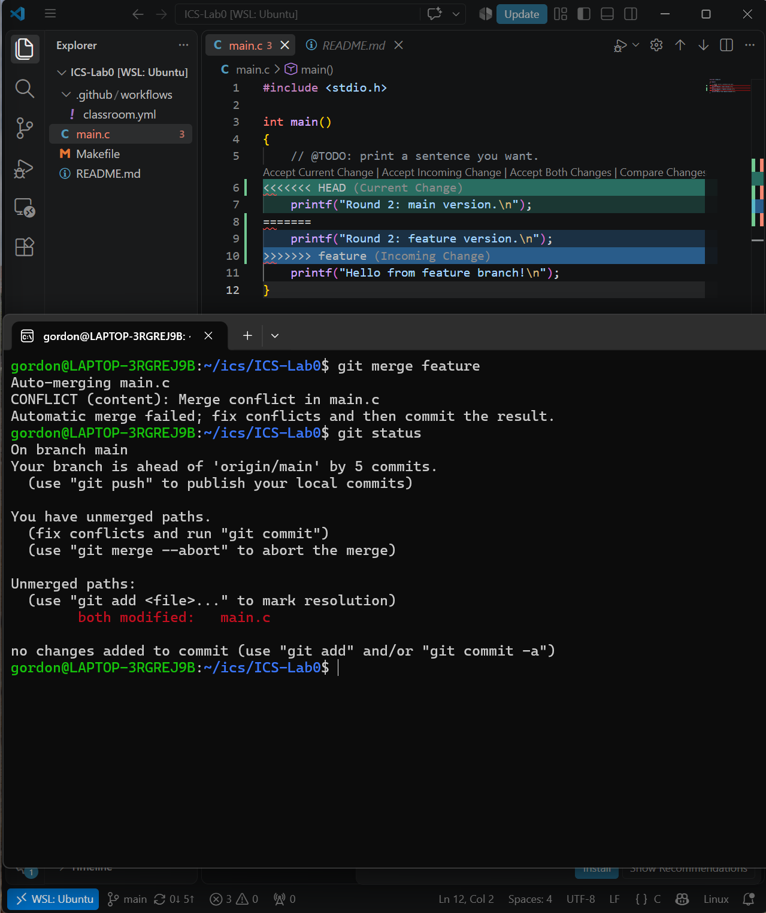
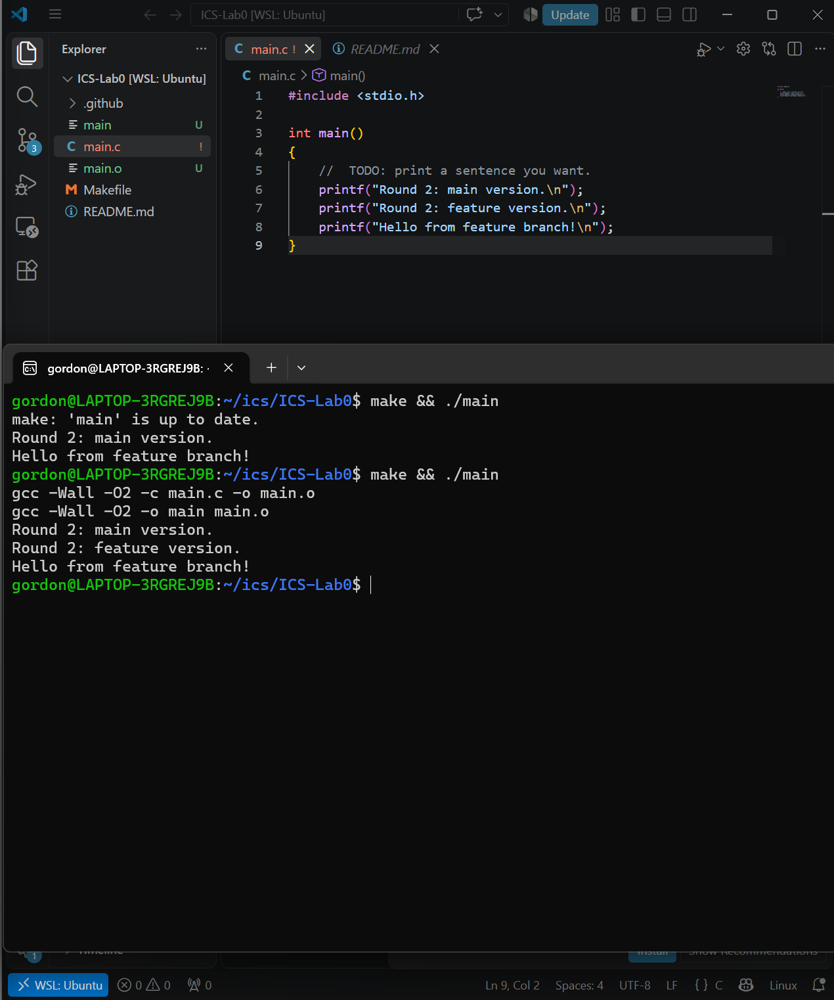
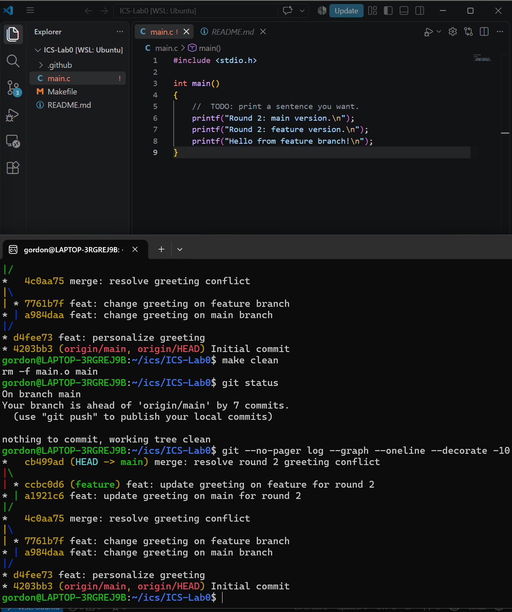
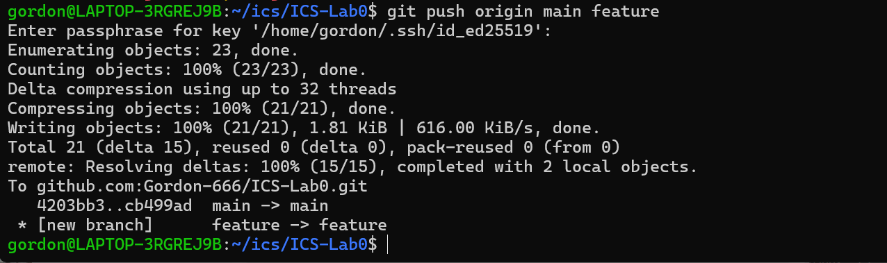
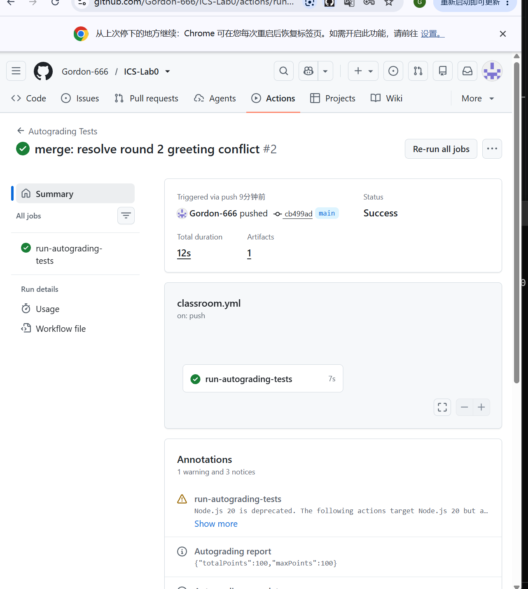

# Lab0：Git 实验报告

- 姓名：曾国鑫
- 学号：25300180091
- 实验仓库：https://github.com/Gordon-666/ICS-Lab0

## 一、问题回答

### 1. 之前的多人协作经历与协作方式

我有初步参与团队开发的经历。在公司研发部门实习期间，我在技术负责人的指导下学习项目架构，并尝试进行代码的本地运行、部署和基本测试。团队通过企业微信群沟通任务、提供指导，并以压缩包和共享文档的形式传递项目代码与相关资料，我按照安排完成基础工作。

我当时主要接触的是文件传递式协作，尚未熟练使用 Git 进行多人版本管理。通过本次实验，我认识到，直接传递压缩包不便于追踪每次修改，也不便于合并不同成员的代码；Git 的提交历史、分支和合并机制能够帮助解决这些问题。

### 2. Git 为什么设计“暂存—提交”两个步骤？

暂存区让我可以先选择哪些修改属于同一次提交，再将它们保存为一个版本。例如，同时修改了代码和报告时，可以先暂存并提交代码，再单独提交报告，使每次提交的目的更清晰。提交前还可以检查暂存内容，减少误提交。

本次实验中，我用 `git add main.c` 将代码修改放入暂存区，再用 `git commit` 保存版本。解决合并冲突后，`git add main.c` 还用于标记该文件的冲突已经解决。暂存和提交分开，使我能控制每次提交包含哪些内容。

### 3. git branch 和 git branch -a 有什么区别？

`git branch` 列出本地分支，并用星号标出当前所在分支。`git branch -a` 除了本地分支，还列出本地记录的远程跟踪分支，例如 `remotes/origin/main`。

这些远程跟踪信息并不是执行命令时实时查询得到的。需要获取远程更新时，可以先执行 `git fetch origin`，再查看分支信息。

## 二、阅读总结

### 1. Commit Message 规范

阅读文章：[Commit message 和 Change log 编写指南](https://www.ruanyifeng.com/blog/2016/01/commit_message_change_log.html)。

文章介绍了如何编写清晰、统一的提交说明。提交说明可以通过 `feat`、`fix`、`docs` 等类型标明修改性质，并用简短描述说明本次修改的内容；必要时还可以补充修改原因等信息。规范的提交说明方便团队理解修改目的、查阅历史，也有助于生成更新日志。本次实验中，我使用了 `feat: …` 描述修改，体会到了明确记录提交目的的作用。这类格式属于协作约定，并不是 Git 强制要求的语法。

### 2. Git Flow 分支控制

阅读文章：[Gitflow 使用规范](https://www.dafaycoding.com/article/git-gif-flow)。

文章介绍了一种分支管理方式：`master` 保存正式发布的稳定代码，`develop` 汇集开发成果，`feature` 用于开发新功能，`release` 用于发布前的测试和修复，`hotfix` 用于紧急修复已发布版本。不同分支按照约定创建和合并，帮助团队协调开发与发布。

Git Flow 能减少开发过程中的相互干扰，但仍可能出现合并冲突，需要人工判断和解决。本次实验练习了分支、提交和合并等基础操作，只使用了 `main` 和 `feature`，没有采用完整的 Git Flow 流程。

### 3. 为什么要学习 Git？

在实习期间，我通过企业微信接收项目压缩包和共享资料，初步参与了团队开发实践。这种文件传递方式便于交接，但不方便追踪每次修改和整合不同成员的代码。

通过本次实验，我学会了提交修改、创建分支、合并分支和解决冲突，也认识到 Git 不只是保存代码的工具。它能够记录修改历史、支持不同任务分别开展，并帮助团队整合成果。规范的提交说明和合理的分支管理方式，可以让协作过程更清楚，也方便出现问题后查找原因。

## 三、实验过程与结果

### 1. 实验环境与第一次修改

本次实验使用 Windows 下的 WSL Ubuntu，通过 VS Code 连接 Linux 项目目录 `/home/gordon/ics/ICS-Lab0`，使用 Git 管理版本，并通过 Makefile 编译 C 程序。

首先修改 `main.c` 中的输出语句，使程序输出：

```text
Hello, ICS! I am Gordon-666.
```

执行 `make && ./main`，确认程序能够编译并输出预期内容。随后用 `make clean` 清理编译产物，再执行：

```bash
git add main.c
git commit -m "feat: personalize greeting"
```

第一次修改对应的提交为 `d4fee73`，可以在后面的提交历史图中看到。

### 2. 创建分支，分别修改并提交

第一次练习中，我创建了 `feature` 分支，在 `feature` 和 `main` 上分别修改同一处问候语并提交，随后合并、解决冲突，得到合并提交 `4c0aa75`。

为完整记录冲突处理过程，我又进行了第二轮操作。先切换到 `feature`，将第一轮合并结果同步过来：

```bash
git switch feature
git merge main
```

接着，在 `feature` 上将第一条输出语句改为 `Round 2: feature version.`，保存并提交；再切换到 `main`，把同一条语句改为 `Round 2: main version.`，保存并提交。

| 分支 | 第二轮修改 | 提交编号 |
| --- | --- | --- |
| feature | 输出 `Round 2: feature version.` | `ccbc0d6` |
| main | 输出 `Round 2: main version.` | `a1921c6` |

两条分支基于共同版本修改了同一行，而且内容不同，为合并冲突创造了条件。本次操作由我在两个分支上完成，用来练习协作中可能遇到的情况。

### 3. 合并分支并遇到冲突

在 `main` 分支执行：

```bash
git merge feature
git status
```

终端提示 `CONFLICT (content): Merge conflict in main.c`，并在状态中显示 `both modified: main.c`。编辑器内出现 `<<<<<<< HEAD`、`=======` 和 `>>>>>>> feature` 等冲突标记，分别标出当前分支和待合并分支的内容。

这说明 Git 无法自动决定同一行应该保留哪种修改，需要我根据预期结果手动处理。



### 4. 解决冲突并验证运行结果

我保留两条分支本轮新增的问候语，清除所有冲突标记，并保留原有的第三条输出。保存后的关键代码为：

```c
#include <stdio.h>

int main()
{
    printf("Round 2: main version.\n");
    printf("Round 2: feature version.\n");
    printf("Hello from feature branch!\n");
}
```

处理过程中曾因文件中仍保留冲突标记而编译失败。清除标记并保存文件后，再执行 `make && ./main`，程序成功输出：

```text
Round 2: main version.
Round 2: feature version.
Hello from feature branch!
```



### 5. 完成合并提交并查看历史

验证结果后，将解决后的文件暂存并提交：

```bash
git add main.c
git commit -m "merge: resolve round 2 greeting conflict"
make clean
git status
git --no-pager log --graph --oneline --decorate -10
```

第二轮合并提交为 `cb499ad`。清理生成的 `main` 和 `main.o` 后，状态显示 `nothing to commit, working tree clean`。提交历史图中可以看到两条分支分别修改后重新汇合，说明合并已经完成。此处的干净状态是添加本报告之前的实验状态。



### 6. 推送到 GitHub 并查看自动测试

执行以下命令，将两个分支推送到远程仓库：

```bash
git push origin main feature
```

终端显示 `main` 更新成功，远程 `feature` 分支创建成功。



在 GitHub Actions 中查看 `main` 分支提交 `cb499ad` 对应的运行结果，状态为 `Success`，自动评分报告显示 `totalPoints: 100`、`maxPoints: 100`。这表示该次提交的自动测试得分为 100/100，不代表包含实验报告评价在内的课程最终成绩。



## 四、实验体会

本次实验让我理解了工作区、暂存区和提交之间的关系，也实际经历了两条分支修改同一行后发生冲突的过程。发生冲突并不意味着仓库损坏，而是需要根据程序预期决定如何整合两边的修改。

解决冲突时，不能只删除提示文字，还要检查保留的代码是否符合预期，保存文件并重新编译运行。之后还需要执行 `git add` 和 `git commit`，才算完成合并。查看 `git status` 和提交历史，可以帮助确认当前操作是否完成。

以后参与团队开发时，我会注意保持提交目的清晰，在合并前后检查代码和运行结果，并按照团队约定使用分支。
